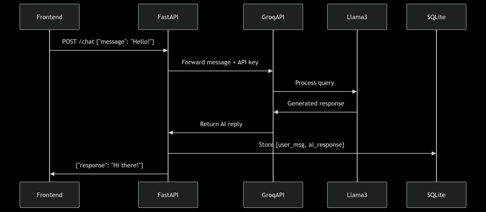

# Taho AI Challenge - Chat Application

A full-stack AI chat application with a Next.js frontend and FastAPI backend using GROQ API for LLM chat completions.



## Project Structure

- `/frontend`: Next.js application for the user interface
- `/backend`: FastAPI application providing chat API endpoints and LLM integration

## Getting Started

### Prerequisites

- Node.js (v16+)
- Python (v3.9+)
- GROQ API key (optional, you can use the built-in key or get one from [GROQ Console](https://console.groq.com/))

### Backend Setup

1. Navigate to the backend directory:

```bash
cd backend
```

2. Create and activate a virtual environment (strongly recommended):

```bash
# Create virtual environment
python -m venv venv

# Activate virtual environment:
# On Windows:
venv\Scripts\activate
# On macOS/Linux:
source venv/bin/activate

# Your terminal prompt should change to indicate the virtual environment is active
```

3. Install dependencies within the virtual environment:

```bash
# Make sure your virtual environment is activated (you should see "(venv)" in your terminal)
pip install -r requirements.txt
```

4. Running the application:

You have two options for running the backend:

#### Option 1: Using the built-in API key (Recommended)

```bash
python run.py
```

This script will automatically:

- Use the secure built-in API key
- Set up the environment variables
- Start the backend server

#### Option 2: Using your own GROQ API key

If you prefer to use your own API key:

```bash
# For Windows Command Prompt
set GROQ_API_KEY=your_api_key_here
python start.py

# For Windows PowerShell
$env:GROQ_API_KEY="your_api_key_here"
python start.py

# For Linux/Mac
export GROQ_API_KEY=your_api_key_here
python start.py
```

The backend will be available at [http://localhost:8000](http://localhost:8000).

### Frontend Setup

1. Navigate to the frontend directory:

```bash
cd frontend
```

2. Install dependencies:

```bash
npm install
```

3. Create a `.env.local` file:

```bash
# API configuration
NEXT_PUBLIC_WEBSOCKET_URL=ws://localhost:8000/ws/chat
NEXT_PUBLIC_API_URL=http://localhost:8000
```

4. Run the development server:

```bash
npm run dev
```

The frontend will be available at [http://localhost:3000](http://localhost:3000).

## System Architecture

The application follows a modern architecture with the following components:

1. **Frontend (Next.js)**

   - React components with TypeScript
   - WebSocket client for real-time communication
   - Tailwind CSS for styling

2. **Backend (FastAPI)**

   - RESTful API endpoints for conversation management
   - WebSocket server for real-time chat
   - Integration with GROQ API for LLM responses

3. **Database (SQLite)**

   - Stores conversation history and messages
   - Async SQLAlchemy for database operations

4. **External API (GROQ)**
   - Powers the AI chat functionality
   - Provides LLM responses via API

## API Documentation

Once the backend server is running, you can access the API documentation at:

- Swagger UI: [http://localhost:8000/docs](http://localhost:8000/docs)
- ReDoc: [http://localhost:8000/redoc](http://localhost:8000/redoc)

## API Endpoints

### REST API

- `GET /conversations`: List all conversations
- `POST /conversations`: Create a new conversation
- `GET /conversations/{conversation_id}`: Get a specific conversation with messages

### WebSocket

- `ws://localhost:8000/ws/chat`: Chat endpoint for streaming responses

#### WebSocket Usage Example

```javascript
const ws = new WebSocket("ws://localhost:8000/ws/chat");

ws.onopen = () => {
  // Send a message
  ws.send(
    JSON.stringify({
      message: "Hello, how can you help me?",
      conversation_id: 1, // Optional, omit to create a new conversation
    })
  );
};
```

## Database Utilities

The backend directory includes database utility scripts to help view and manage the SQLite database:

- `backend/view_database.py`: A utility script that shows database structure, tables, columns, and sample data.

  - Lists all tables in the database
  - Displays column structure for each table
  - Shows sample data (up to 5 rows) from each table

- `backend/view_data.py`: A detailed data viewer that focuses on conversation content:
  - Displays conversation statistics (total conversations, messages)
  - Shows message counts by role (user, assistant, system)
  - Lists all conversations with creation dates and message counts
  - Displays the full message history for each conversation with formatted timestamps

### Running Database Utilities

```bash
cd backend
python view_database.py  # To view database structure
python view_data.py      # To view conversation data
```

These utilities are helpful for development, debugging, and understanding the application's data model.
